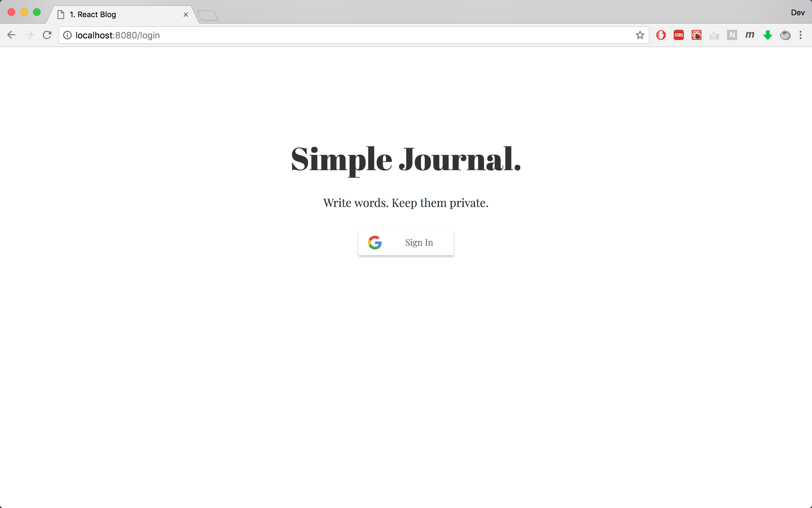
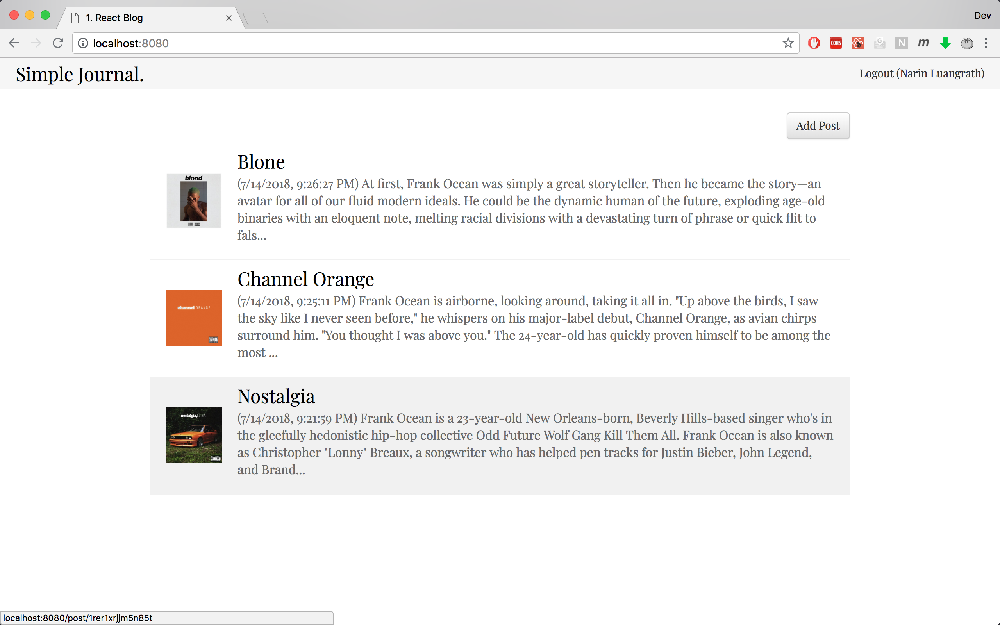
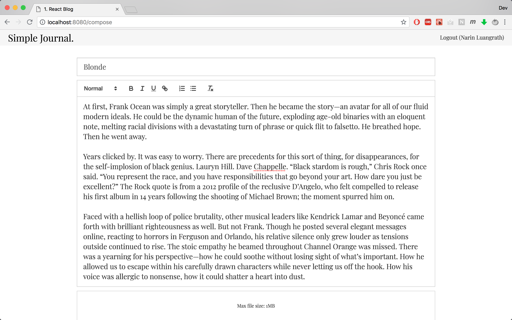
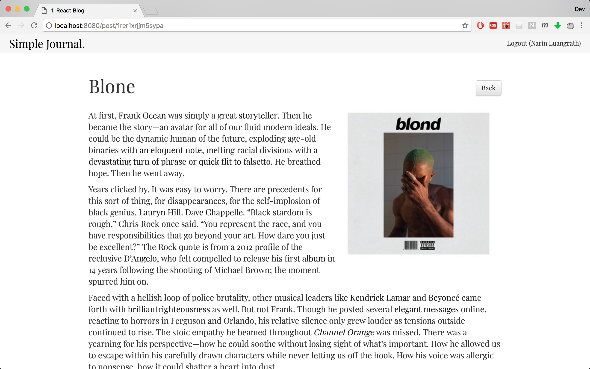

# Simple Journal (UI)

A simple journal for storing text and photos. Made with React.

## Features

- Minimalistic user interface
- User management using Google Sign-in (OAuth2)
- Feature rich text editor
- Images embeded within journal entry

## To run locally

1. Run [the backend server](https://github.com/narinluangrath/simple-journal-server.git) first.
2. `git clone https://github.com/narinluangrath/simple-journal-ui.git && cd simple-journal-ui`
3. Edit the `config.js` file
4. `npm install`
5. `npm start`

## Technology used

- React
- Redux
- Webpack
- Babel
- Bootstrap
- SASS